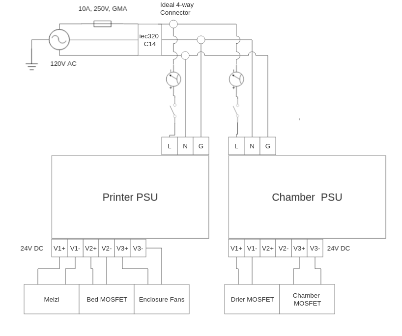

# Custom Electronics and Electronics Enclosure

# Requirements
* Support chamber heater and Filament dryer
    * Adding Mosfets and additional wiring and board pinout support to enable this
* Relocate electronics from underneath the printer to outside the chamber
* Measure power draw
* Electric components, especially main board and its pinouts should be "easily" accesible
    * Will encorpaerate a method "sliding" base plates that secucre components
* All wiring should be evaluated for current draw and proper gauge wire shall be used
* Enclosure should have quick connects to quickly disconnect all wires going to the printer.

# Wiring Diagrams

# Connector and Pinout Table
 | Connector | ATmega2560 Pins | Connector Type (board side) | Connector Type (target side) |
 | --- | --- | --- | --- |
 | | | |

# Bill of Materials

| Material | Quantity | Link |
| --- | --- | --- |
| 2020 Aluminum T slot | 10 400mm | https://www.amazon.com/dp/B0B2P434PD?psc=1&ref=ppx_yo2ov_dt_b_product_details |
| 8mm M3 Bolts and 2020 M3 t slot nuts | 88  | To secure outer walls of case to frame. Each outer and upper wall gets 8. 2 fan plates, 4 Electronic wall plates, 2 upper plates, 2 psu wall plates, and 1 psu wall plate for 11 total.  |
| 12mm M3 Bolts | 16 | To secure fans to fan plate |
| 8mm M4 bolts | 8 | To secure PSUs to bottom plate |
| 16mm M3 Bolts + spaces + nuts | 17 | To secure melzi and MOSFET boards to bottom plates |
| 40x40x10 fans | 4 | https://www.amazon.com/dp/B088665SKK?psc=1&ref=ppx_yo2ov_dt_b_product_details | 
| Additional NTC Thermistors | 5 | https://www.amazon.com/dp/B0714MR5BC?psc=1&ref=ppx_yo2ov_dt_b_product_details |
| PTC heater (filament dehydrator) | 1 at 150W | https://www.amazon.com/dp/B07JKNKK7J?psc=1&ref=ppx_yo2ov_dt_b_product_details |
| PTC heater (chamber heater) | 1-2 at 150-250W | - |
| Mosfets | 3 | https://www.amazon.com/dp/B07C4PGXFK?psc=1&ref=ppx_yo2ov_dt_b_product_details |
| Meanwell RSP-500-24 PSU | 2 | [Stock Meanwell RSP-500-24](MeanWell_500_Datasheet.pdf) |
| Creality Melzi v2.2 | 1 | Stock |
| Switches | 2 | Standard 30A 120V AC switches |
| 10A 250V GMA Fuse | 1 | Integrated in AC plug |
| AC Plug | 1 | iec320 C14 |
| Ampmeters?? | 2 | - |
| Wire | ??? | Fill this out |
| JST Connectors | ?? | Fill this out | 
