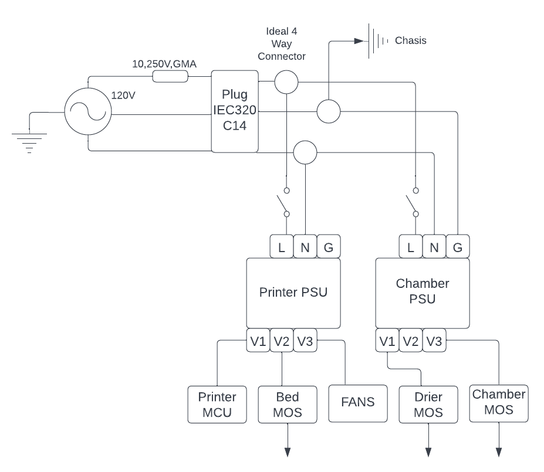

# Electronics Enclosure

# Requirements
* Relocate electronics from underneath the printer to outside the chamber in standalone enclosure
* Allow enough space (or extensibility) to support electronics for chamber heater, filament dehydrator and other requirements listed on main page.
    * This would include space for 2 PSUs and up to 3 MOSFETs
    * Holds base printer MCU and possibly other MCUs to control other components.
    * Possibly support a screen.
    * Possibly support access to printer MCU SD card
    * Shall support access to printer MCU serial port
* All wiring and connectors shall be analzed for power usage and proper guage wire / connector size shall be used.
* Provide neat cable managment from electronics enclosure to printer.
* Preferably give easy access to electronics for prototyping.

# Wiring Diagrams and Connector Table

Power supply wiring diagram. The 10A GMA fuse is integrated into the iec320 AC plug.

| Connection Source | Connection Sink | Connector Source | Connector Sink | V | W | Wire Gauge |
| --- | --- | --- | --- | --- | --- | --- |
| Live iec320 | Live Ideal Connector | Female Disconnect | Bare (push in) | 120V AC | 1000W + | 12 AWG (rated to 20A AC or 2400W) |
| Neutral iec320 | Neutral Ideal Connector | Female Disconnect | Bare (push in) | 120V AC | 1000W + | 12 AWG (rated to 20A AC or 2400W) |
| Ground iec320 | Ground Ideal Connector | Female Disconnect | Bare (push in) | 120V AC | 1000W + | 12 AWG (rated to 20A AC or 2400W) |
| Live Ideal Connector | Printer Switch | Bare (push in) | Female Disconnect | 120V AC | 500W + | 16 AWG (rated to 10A AC or 1200W) |
| Live Ideal Connector | Chamber Switch | Bare (push in) | Female Disconnect | 120V AC | 500W + | 16 AWG (rated to 10A AC or 1200W) |
| Printer Switch | Printer PSU Live terminal | Female Disconnect | Spade connector (8 to 10 stud size) | 120V AC | 500W + | 16 AWG (rated to 10A AC or 1200W) |
| Chamber Switch | Chamber PSU Live terminal | Female Disconnect | Spade connector (8 to 10 stud size) | 120V AC | 500W + | 16 AWG (rated to 10A AC or 1200W) |
| Neutral Ideal Connector | Printer PSU Neutral Terminal | Bare (push in) | Spade connector (8 to 10 stud size) | 120V AC | 500W + | 16 AWG (rated to 10A AC or 1200W) |
| Neutral Ideal Connector | Chamber PSU Neutral Terminal | Bare (push in) | Spade connector (8 to 10 stud size) | 120V AC | 500W + | 16 AWG (rated to 10A AC or 1200W) |
| Ground Ideal Connector | Printer PSU Ground Terminal | Bare (push in) | Spade connector (8 to 10 stud size) | 120V AC | 500W + | 16 AWG (rated to 10A AC or 1200W) |
| Ground Ideal Connector | Ground PSU Neutral Terminal | Bare (push in) | Spade connector (8 to 10 stud size) | 120V AC | 500W + | 16 AWG (rated to 10A AC or 1200W) |
| Ground Ideal Connector | Chasis | Bare (push in) | .25in ring connector | 120V AC | 1000W + | 12 AWG (rated to 10A AC or 1200W) |
| Printer V1+/- | Printer MCU +/- Input | Spade connector (8 to 10 stud size) | Bare (screw down) | 24V DC |  <240W | 16 AWG (rated to 10A DC or 240W) |
| Printer V2+/- | Bed MOSFET +/- Input | Spade connector (8 to 10 stud size) | Bare (screw down) | 24V DC | 500W + | 12 AWG (rated to 20A DC or 480W) |
| Printer V3+/- | Fans |  Spade connector (8 to 10 stud size) | Dupont Connector | 24V DC | < 7W | 26 AWG |
| Chamber V1+/- | Drier MOSFET +/- Input | Spade connector (8 to 10 stud size) | Bare (screw down) | 24V DC | 150W | 16 AWG (rated to 10A DC or 240W) |
| Chamber V3+/- | Chamber MOSFET +/- Input | Spade connector (8 to 10 stud size) | Bare (screw down) | 24V DC | ??? | ??? |
| Bed MOSFET Output +/- | Terminal Device | Bare (screw down) | -  | 24V DC | 500W + | 12 AWG (rated to 20A DC or 480W) |
| Drier MOSFET Output +/- | Terminal Device | Bare (screw down) | -  | 24V DC | 150W | 16 AWG (rated to 10A DC or 240W) |
| Chamber MOSFET Output +/- | Terminal Device | Bare (screw down) | - | 24V DC | ??? | ??? |

# Bill of Materials

| Material | Quantity | Notes |
| --- | --- | --- |
| 2020 Aluminum T slot | 10 400mm | https://www.amazon.com/dp/B0B2P434PD?psc=1&ref=ppx_yo2ov_dt_b_product_details |
| 8mm M3 Bolts and 2020 M3 t slot nuts | 88+12+8  | To secure outer walls of case to frame. Each outer and upper wall gets 8. 2 fan plates, 4 Electronic wall plates, 2 upper plates, 2 psu wall plates, and 1 psu wall plate for 11 total plates. 12 addional to secure mosfets. Another 8 to secure plexiglass to cpu and mosfet front wall. |
| 12mm M3 Bolts | 16 | To secure fans to fan plate |
| 8mm M4 bolts | 8 | To secure PSUs to bottom plate |
| 16mm M3 Bolts + spaces + nuts | 17 | To secure Printer MCU and MOSFET boards to bottom plates |
| 40x40x10 fans | 4 | At 24V, .07A draw. https://www.amazon.com/dp/B088665SKK?psc=1&ref=ppx_yo2ov_dt_b_product_details | 
| Additional NTC Thermistors | 5 | https://www.amazon.com/dp/B0714MR5BC?psc=1&ref=ppx_yo2ov_dt_b_product_details |
| PTC heater (filament dehydrator) | 1 at 150W | https://www.amazon.com/dp/B07JKNKK7J?psc=1&ref=ppx_yo2ov_dt_b_product_details |
| PTC heater (chamber heater) | 1-2 at 150-250W | - |
| Mosfets | 3 | https://www.amazon.com/dp/B07C4PGXFK?psc=1&ref=ppx_yo2ov_dt_b_product_details |
| Meanwell RSP-500-24 PSU | 2 | [Stock Meanwell RSP-500-24](../../DataSheets/MeanWell_500_Datasheet.pdf) |
| Printer MCU  | 1 | Currently SKR Mini E3 V3 |
| Switches | 2 | Standard 30A 120V AC switches |
| 10A 250V GMA Fuse | 1 | Integrated in AC plug |
| Ideal 4 way Push in connectors | 3 | 16AWG to 12AWG, rated to 20A|
| Various disconnect connectors | >20 | Various sizes, 10AWG to 22AWG, amp rating appropiate to wire gauge. Use appropiate sized connectore given wire gauge |
| Spade Connectors | >20 | 16AWG to 12AWG, 8 to 10 Stud size | 
| AC Plug | 1 | iec320 C14 |
| Wire 16AWG, 12AWG | A few meters of each | - |
| Ampmeters?? | 2 | - |
