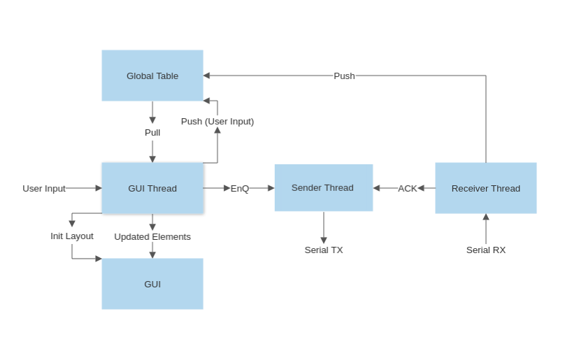

# MEME Controller

G code sender, printer montoring and control, and interface for executing testing/calibration sequences.

# Serial Communication

* Sending and recv-ing commands is done through the USB serial port (/dev/ttyACM0 for skr mini E3 V3.0)
* Commands are send in ascii delimited by a new line char
* The command protocal is [G-code](../marlin/Marlin_Docs/_gcode/)
* All commands, if properly recv-ed by the printer, are ACK-ed with a response "ok" 

# Dependancies
* pip3 install customtkinter
* sudo apt-get install python3-tk
* Python 3.8.10

# Architecture

## GUI Thread
* Uses [customtkinter](https://github.com/TomSchimansky/CustomTkinter) python GUI frame work
* Defines a series of tabs that pack similiar functionality together
    * Printer Tab for seeing current temps, pos, etc and provides terminal to send G code
    * ... MORE TABS
* Organizes printer state and corresponding GUI elements in the "global table"
* Accessor funtions are provided to 

## Sender Thread
* Blocks until one of the following occur, an enQ, an ACK, a kill message, or a timeout.
* If its a timeout, check that we are still alive and go back to waiting
* If its a kill message just break out of main loop, clean up, and exit
* If its an enQ and we are not waiting on a previous commands ACK, send it
* If its an enQ but we are waiting on a previous commands ACK do nothing
* If its an ACK, remove the top command in the queue, store it to log and attempt to send the next one
* Thread logic is controlled using a control variable
* When a calling thread calls enQ, ACK, or kill, access to these functions are mutually exclusive with the sender thread running its thread logic

## Recv-er Thread
* Block on input from serial
* Parse input
    * If its and ACK, notify sender thread
    * If its printer state, push that to the global table
    * Global table should contain matching criteria to determine if input contains state
* Maintains "parse table" dictionary which is a sub set of the GUI threads global table.
    * First index is internal key
    * Second index is in ['prefix', 'regex', 'multiline']
        * prefix should be a unique prefix that identifies the input from the printer as a response to a specific command
        * regex is the regex string to pull whatever data is relavent from response
        * multi line = 0 or 1 indicating if its a multiline response
            * If the recver thread matches the prefix from a multi line response, it will capture all the input, line for line, matching the regex statement until it sees an ACK ("ok").