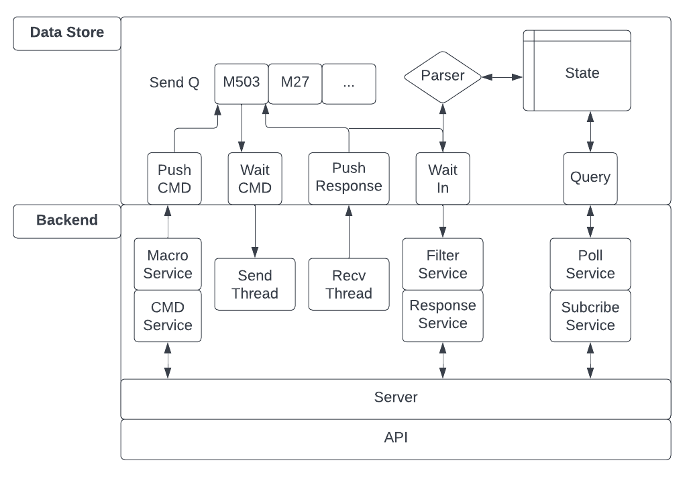

# MEME Controller

G code sender, printer montoring and control, and interface for executing testing/calibration sequences.

# Serial Communication

* Sending and recv-ing commands is done through the USB serial port (/dev/ttyACM0 for skr mini E3 V3.0)
* Commands are send in ascii delimited by a new line char
* The command protocal is [G-code](../marlin/Marlin_Docs/_gcode/)
* All commands, if properly recv-ed by the printer, are ACK-ed with a response "ok" 

# Dependancies
* Python 3.8.10
* textual

# Backend Architecture

## Data store
The data store is a per printer data structure that maintains 2 data elements and 4 main functions. Data elements:

1) `sendQ` The send Q holds a list of g code commands to be sent to the printer. The next command is sent only when the active command is ACKed by the printer. Each command is wrapped in Job class that holds timestamps for when its enqueued, sent, and ACKed. Finally, all responses from when the command is sent to when it is ACKed are stored with the command for logging purposes.
2) `StateMap` Tracks relavent state i.e. nozzle temp, target temps, current position, firware settings, etc. Holds a unique prefix and regex for parsing the responses that contain state information.

These data elements are accessed through the following functions:

1) `push_cmd(command)` Pushes a gcode command onto the sendQ to be sent when ready
2) `wait_cmd()` Blocks until the printer is ready for the next command. Returns string of command to be sent.
3) `push_reponse(line)` Register a response from the printer to the data store. Parsing of state happens here.
4) `query(key)` Returns current state value of the given key. Keys are short state decriptions like `nozzle temp current`. `get_all_state_keys()` returns list of acceptable keys.

## Backend
Implements all IO and networking functionality 
* **Send/Recv Thread.** Blocks on IO from printer via serial and registers IO with the data store
* **Response Publisher.** Thread to push ALL unparsed responses from printer over a port. This could be a pipe for local debugging or a socket for a networed UI to capture.
* **Server thread.** Thread to recv commands and macros over a socket and push them to the send Q. Handles all incoming packets, parses them, and takes apporpiate action.
* **Polling Thread.** Polls subscribed state and sends reports to client over network at 1s interval.

### Network API
The applciation protocol for communicating with the back end follows the following. All packets are at most 64 bytes and are terminated with a new line. All packets have a 4 byte ascii packet idetifying prefix, followed by an ascii space, followed by the payload.

| API Call | Sender | Example Packet Structure | Response | Comments | 
| --- | --- | --- | --- | --- |
| Send Command | Client | b'cmdG M503\n' | none | Client sends 'cmdG 'in ascii followed by gcode command (max 59 char) |
| Subscribe to Serial Reponses | Client | b'subR 1\n' | b'subR ...' | Client sends 'subR ' in ascii followed by 0,1,2 in ascii. V=0 -> Dont sent serial input. V=1 -> Send serial input but filter out polled responses (like auto temp report). V=2 -> Send all serial input. Server responds with subR prefix followed by responses from printer |
| Subscribe to State | Client | b'subS nozzle temp current\n' | b'subS key value' | Client sends 'subS ' followed by state key. Resend the same subS request to unsub. Server responds with subS prefix followed by key followed by value |

# TODO
* deal with unbounded sendQ and logging
* macros and storing them
* SD stuff
* Implement actual GUI
* Update picture and backend doc (verify data store doc is good)
